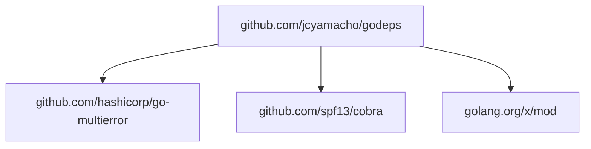

# godeps
golang dependency analyzer

## install
```bash
go install github.com/jcyamacho/godeps@latest
```

## commands

### *flowchart*
generate a dependency graph mermaid flowchart
#### flags:
-  -h, --help, help for flowchart
-  -s, --skip, skip modules
-  -i, --skip-indirect, skip indirect dependencies (default true)
#### args:
- [path], golang module directory to scan
#### example:
